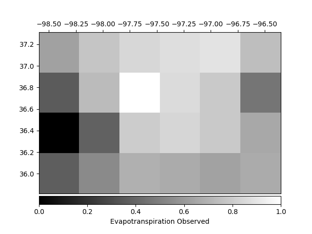
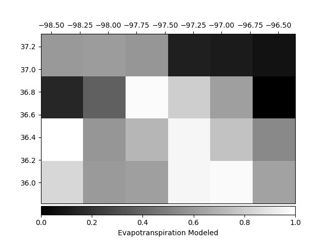
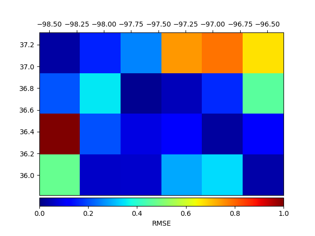

# Comparing-images
Structural similarity (SSIM) index and mean squared error (MSE)

  
  
  

SSIM: 0.156 

RMSE: 0.389

Dependences:

    python - Scikit-image
    python - Pandas
    python - NumPy
    python - Matplolib
    python - Gdal
    python - Scikit-learn

Page source:

http://scikit-image.org/docs/dev/auto_examples/transform/plot_ssim.html
